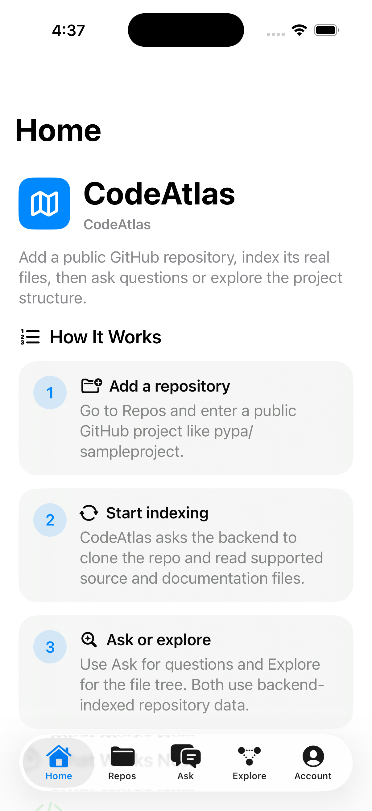
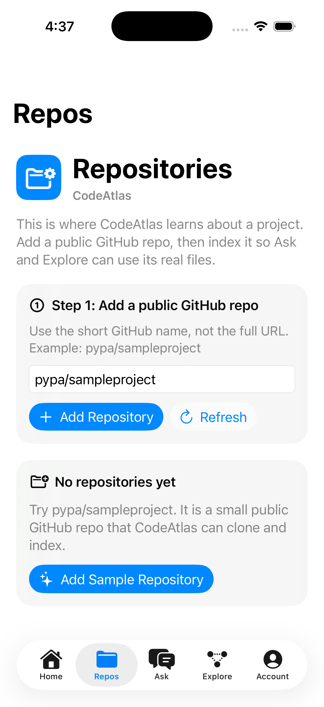
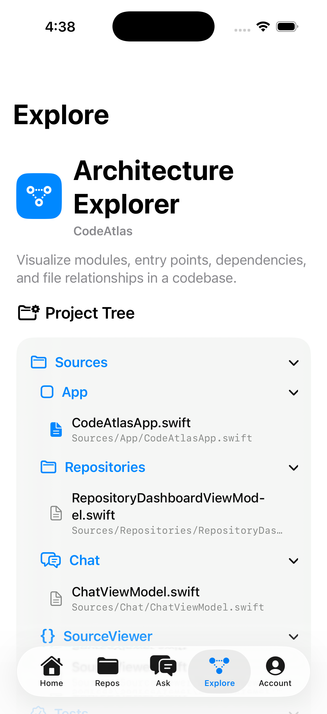
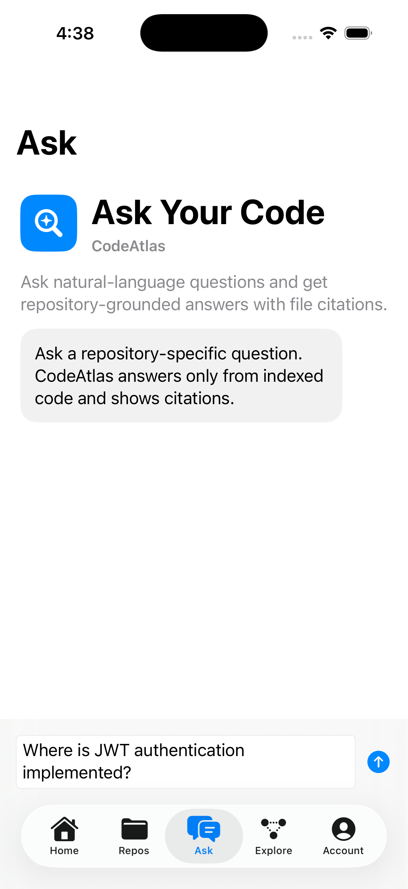
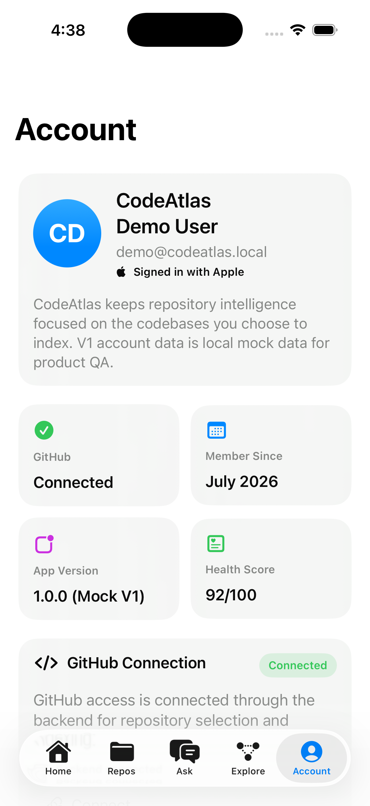

# CodeAtlas

CodeAtlas is a native iOS and FastAPI portfolio application that helps engineers understand, review, and navigate software repositories.

The app connects to GitHub, indexes repository files, and gives repository-aware answers, code review notes, architecture summaries, and source navigation. The goal is focused code intelligence: answers should be grounded in the indexed repository instead of behaving like a generic chatbot.

## What It Demonstrates

- Native SwiftUI product design with a polished tab-based iOS experience
- MVVM-style screen organization with service protocols and dependency boundaries
- Sign in with Apple and secure token storage using Keychain
- GitHub OAuth flow for repository connection
- FastAPI backend with authentication, repository ingestion, indexing, search, and review endpoints
- Local development persistence plus PostgreSQL-ready backend configuration
- Docker Compose support for PostgreSQL, Redis, and API services
- Backend tests covering core API flows
- Portfolio-ready product, architecture, security, and API documentation

## Core Features

- **Repository Dashboard**: add, view, index, and remove GitHub repositories.
- **AI Code Review**: scans indexed code for reliability, security, maintainability, and performance risks.
- **Ask Your Code**: ask natural-language questions about an indexed repository.
- **Architecture Explorer**: browse repository structure and inspect files.
- **Source Viewer**: view indexed files with context.
- **Account**: Apple login, GitHub connection state, account actions, and privacy screens.
- **Mock Demo Mode**: run the iOS experience without external accounts for quick demos.

## Repository Layout

```text
Code Atlas/
  Code Atlas/                 iOS SwiftUI application
  backend/                    FastAPI backend
  docs/                       Product, API, architecture, security, and portfolio docs
```

## Quick Start

### iOS App

1. Open `Code Atlas.xcodeproj` in Xcode.
2. Select an iPhone simulator.
3. Build and run.
4. Use **Continue with Mock Session** for demo mode, or use **Continue with Apple** after enabling Apple Sign In in Xcode and signing into Apple ID on the simulator.

### Backend

From the project root:

```bash
backend/.venv/bin/uvicorn app.main:create_app --factory --reload --app-dir backend
```

The backend runs at:

```text
http://127.0.0.1:8000
```

Health check:

```text
http://127.0.0.1:8000/health/ready
```

API docs:

```text
http://127.0.0.1:8000/docs
```

## GitHub OAuth Setup

Create a GitHub OAuth App:

```text
Homepage URL: http://127.0.0.1:8000
Authorization callback URL: http://127.0.0.1:8000/api/v1/repositories/github/oauth/callback
```

Add these values to `.env` and `backend/.env`:

```text
CODEATLAS_GITHUB_CLIENT_ID=your_client_id
CODEATLAS_GITHUB_CLIENT_SECRET=your_client_secret
CODEATLAS_GITHUB_OAUTH_REDIRECT_URL=http://127.0.0.1:8000/api/v1/repositories/github/oauth/callback
```

Do not commit `.env` files. They are ignored by Git.

## Local Development Flow

1. Start the backend.
2. Run the iOS app.
3. Sign in with Apple or mock session.
4. Connect GitHub from the Account tab.
5. Add a repository in `owner/repo` format.
6. Start indexing.
7. Use Explore, Ask, and Review to inspect the repository.

## Screenshots

| Home | Repositories |
| --- | --- |
|  |  |

| Architecture Explorer | Ask Your Code |
| --- | --- |
|  |  |

| Account |
| --- |
|  |

## Documentation

- [Product Requirements](docs/PRD.md)
- [Architecture](docs/ARCHITECTURE.md)
- [API Contract](docs/API_CONTRACT.md)
- [Database Schema](docs/DATABASE_SCHEMA.md)
- [Security and Privacy](docs/SECURITY_PRIVACY.md)
- [Implementation Plan](docs/IMPLEMENTATION_PLAN.md)
- [Portfolio Case Study](docs/PORTFOLIO_CASE_STUDY.md)
- [Demo Script](docs/DEMO_SCRIPT.md)
- [Screenshot Guide](docs/SCREENSHOT_GUIDE.md)
- [LinkedIn Post Draft](docs/LINKEDIN_POST.md)
- [App Store Description Draft](docs/APP_STORE_DESCRIPTION.md)

## Production Readiness

CodeAtlas is portfolio-ready as a full-stack engineering project. Before treating it as a production SaaS product, the remaining work is:

- Replace deterministic review logic with a production LLM and embedding provider
- Add durable async workers for indexing at scale
- Complete PostgreSQL deployment and migration workflow in hosted infrastructure
- Add real repository permission syncing and refresh handling
- Add observability, error tracking, audit logs, and deployment automation
- Expand test coverage around iOS UI flows and backend security boundaries

## Security Notes

- Repository content is treated as sensitive and untrusted.
- Tokens are stored in Keychain on iOS.
- Backend secrets live in local `.env` files and are excluded from Git.
- OAuth secrets should be rotated before any public demo or deployment.

## Status

Portfolio MVP: complete.

Production SaaS: in progress.
